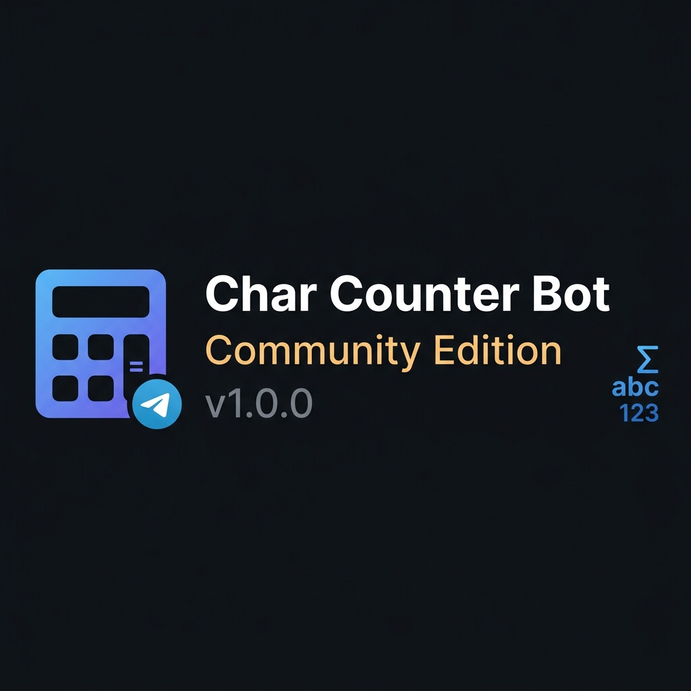
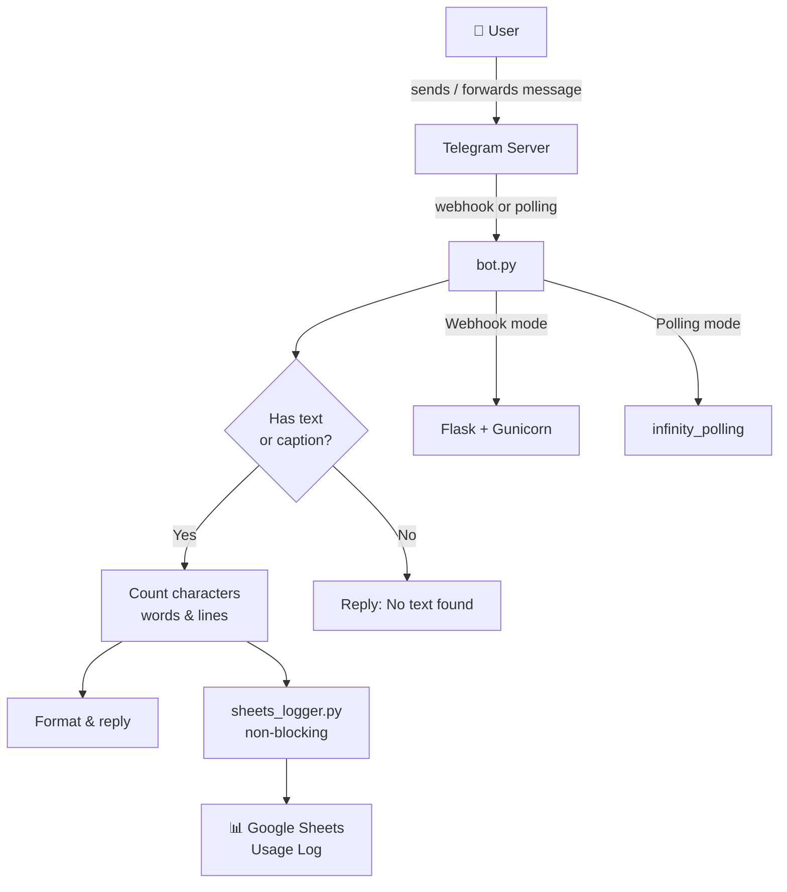

<div align="center">



# Char Counter Bot

### Community Edition — v1.0.0

**Telegram bot that instantly counts characters, words, and lines in any text or forwarded message.**

Send or forward any message — get a precise breakdown in milliseconds. Zero friction, zero setup for end users.

---

[](https://github.com/futurecoderin/char-counter-bot/releases/tag/v1.0.0)
[](LICENSE)
[](https://www.python.org/)
[](https://core.telegram.org/bots)
[](https://github.com/futurecoderin/char-counter-bot)
[](https://github.com/futurecoderin/char-counter-bot)

</div>

---

## What is this?

**Char Counter Bot** is a lightweight, production-ready Telegram bot that analyses any text message and returns a detailed character, word, and line count — instantly.

Perfect for writers checking tweet/post limits, developers counting API payload sizes, content creators verifying character caps, or anyone who needs a quick text analysis without leaving Telegram.

Works with direct messages, forwarded posts, and media captions.

---

## Features

| Feature | Description |
|---|---|
| ✅ **Character Count** | Total characters including spaces |
| ✅ **Character Count (no spaces)** | Pure content characters only |
| ✅ **Word Count** | Whitespace-delimited word count |
| ✅ **Line Count** | Newline-separated line count |
| ✅ **Forwarded Message Support** | Analyse posts forwarded from any chat or channel |
| ✅ **Media Caption Analysis** | Works on photos, videos, documents with captions |
| ✅ **Instant Response** | Results in milliseconds |
| ✅ **Google Sheets Logging** | Optional usage analytics via Service Account |
| ✅ **Polling & Webhook Modes** | Local polling or production webhook (Render, Railway, etc.) |
| ✅ **Gunicorn Ready** | Production WSGI server support out of the box |

---

## Demo

**Input (sent or forwarded to the bot):**
```
Hello world!
This is a test message.
Three lines total.
```

**Bot reply:**
```
📊 Text Analysis
━━━━━━━━━━━━━━━━━━
• Total Characters:       50 (including spaces)
• Characters (no spaces): 42
• Words:                  9
• Lines:                  3

💡 Tip: You can also forward messages from other chats!
```

---

## Architecture



---

## Requirements

- Python 3.9+
- A Telegram Bot token (from [@BotFather](https://t.me/BotFather))
- **Optional:** Google Cloud Service Account for usage logging

**Python packages:**
```
pyTelegramBotAPI>=4.26.0
python-dotenv>=1.0.1
Flask>=3.0.3
gunicorn>=22.0.0
gspread>=6.0.0         # optional — for Sheets logging
google-auth>=2.0.0     # optional — for Sheets logging
```

---

## Installation

### Step 1 — Clone the repository

```bash
git clone https://github.com/futurecoderin/char-counter-bot.git
cd char-counter-bot
```

### Step 2 — Create a virtual environment

```bash
python3 -m venv venv
source venv/bin/activate        # Linux / macOS
# venv\Scripts\activate.bat     # Windows
```

### Step 3 — Install dependencies

```bash
pip install -r requirements.txt
```

### Step 4 — Configure environment

```bash
cp .env.example .env
nano .env
```

Set at minimum:
```env
TELEGRAM_BOT_TOKEN=your_token_from_botfather
```

### Step 5 — Create your Telegram Bot

1. Open Telegram → search **@BotFather**
2. Send `/newbot` and follow the prompts
3. Copy the token into your `.env`

### Step 6 — Run (polling mode — local development)

```bash
python bot.py
```

You should see:
```
Bot is running... Press Ctrl+C to stop.
```

Send `/start` to your bot — it should reply immediately.

### Step 7 — Deploy (webhook mode — production)

Set `WEBHOOK_URL` in your `.env` to your public server URL:

```env
WEBHOOK_URL=https://myapp.onrender.com
```

Then run with gunicorn:

```bash
gunicorn bot:app --bind 0.0.0.0:8080
```

---

## Configuration

All settings are in `.env` (copied from `.env.example`):

| Variable | Required | Default | Description |
|---|---|---|---|
| `TELEGRAM_BOT_TOKEN` | ✅ Yes | — | Bot token from @BotFather |
| `WEBHOOK_URL` | No | — | Public HTTPS URL for webhook mode |
| `RENDER_EXTERNAL_URL` | No | — | Auto-set by Render.com deployments |
| `PORT` | No | `8080` | Port for webhook server |
| `GOOGLE_SPREADSHEET_ID` | No | — | Sheets ID for usage logging |
| `GOOGLE_CREDENTIALS_PATH` | No | `./google_credentials.json` | Path to SA key file |

---

## Google Sheets Logging (Optional)

When configured, every bot interaction is logged to a Google Sheet:

| Column | Description |
|---|---|
| **Timestamp (UTC)** | When the event occurred |
| **User ID** | Telegram user ID |
| **Username** | `@username` or N/A |
| **Full Name** | First + last name |
| **Language** | Telegram language code |
| **Action** | e.g. `/start or /help`, `Text Analyzed`, `Forwarded Message`, `No Text Sent` |
| **Detail** | e.g. `chars=142, words=28, lines=3` |

### Setup

1. Create a [Google Cloud](https://console.cloud.google.com/) project
2. Enable the **Google Sheets API**
3. Create a **Service Account** → download JSON key
4. Place the key at the path set in `GOOGLE_CREDENTIALS_PATH`
5. Set `GOOGLE_SPREADSHEET_ID` in `.env`
6. Share your spreadsheet with the service account email (Editor access)

Logging is fully optional — the bot runs normally if credentials are missing.

---

## Deploying to Render (Free Tier)

1. Fork this repository
2. Create a new **Web Service** on [Render](https://render.com)
3. Connect your forked repo
4. Set environment variables in Render's dashboard
5. Render sets `RENDER_EXTERNAL_URL` automatically — webhook mode activates

---

## Troubleshooting

<details>
<summary><b>Bot doesn't respond to messages</b></summary>

```bash
# Test your token
curl "https://api.telegram.org/bot<TOKEN>/getMe"
# Should return {"ok":true,...}
```

Make sure you've started a conversation with the bot first (send `/start`).

</details>

<details>
<summary><b>TELEGRAM_BOT_TOKEN is not set</b></summary>

```bash
ls -la .env          # check the file exists
cat .env             # verify the token is in there
```

The `.env` file must be in the same directory as `bot.py`.

</details>

<details>
<summary><b>Webhook not working</b></summary>

- Your `WEBHOOK_URL` must be publicly accessible over HTTPS
- Telegram requires a valid TLS certificate (Render and Railway provide this automatically)
- Check that port 443, 80, 88, or 8443 is reachable

```bash
# Check current webhook status
curl "https://api.telegram.org/bot<TOKEN>/getWebhookInfo"
```

</details>

<details>
<summary><b>Google Sheets not logging</b></summary>

1. Confirm `GOOGLE_SPREADSHEET_ID` is set in `.env`
2. Confirm the credentials JSON file exists at `GOOGLE_CREDENTIALS_PATH`
3. Confirm the service account email has **Editor** access to the sheet
4. Check bot logs for `Sheets:` warning lines

</details>

<details>
<summary><b>ImportError on gspread / google-auth</b></summary>

```bash
pip install gspread google-auth
```

These packages are listed in `requirements.txt` but are only needed if you use Sheets logging.

</details>

---

## Roadmap

### Community Edition

| Version | Focus |
|---|---|
| **v1.1** | Sentence count, average word length, reading time estimate |
| **v1.2** | `/stats` command showing your personal usage history |
| **v1.3** | Multi-language character set detection |
| **v1.5** | Inline mode support |

### Professional Edition *(Coming Soon)*

> The **Professional Edition** will extend this bot with enterprise-grade features.

| Feature | Description |
|---|---|
| 📊 **Usage Dashboard** | Web UI showing per-user and aggregate analytics |
| 🔔 **Alerts** | Notify when a text exceeds a configured character limit |
| 🌍 **Multi-language UI** | Bot replies in the user's language |
| 📁 **File Analysis** | Count characters in uploaded `.txt` / `.docx` files |
| 🔒 **Private Deployment** | Docker-based self-hosted setup with config management |
| 🎧 **Priority Support** | Guaranteed response for issues and custom integrations |

---

## Community Edition Notice

This repository is the **fully functional Community Edition** of Char Counter Bot, open-source under the MIT license.

A future **Professional Edition** will build on this foundation with advanced analytics, a web dashboard, file analysis, and enterprise deployment tooling.

---

## Support

### Community Support

For bugs and feature requests:
👉 [Open a GitHub Issue](https://github.com/futurecoderin/char-counter-bot/issues)

### Paid Services

| Service | Description |
|---|---|
| 🛠 **Setup & Deployment** | Get the bot running on your server |
| ⚙️ **Custom Configuration** | Tailored bot responses and logging |
| 🔌 **Custom Integrations** | Connect to your own analytics or CRM |
| 🧩 **Feature Development** | Sponsor a roadmap feature |
| 🎧 **Professional Support** | Priority access and guaranteed response |

Contact via GitHub Issues with the `[paid-support]` tag.

---

## Buy Me a Coffee ☕

If Char Counter Bot saved you time or helped your project, consider a small contribution!

Every coffee funds time spent on new features, bug fixes, and community support.

**UPI:** `abhishekk492@okaxis`

Thank you! 🙏

---

## Contributing

Contributions are welcome. Please read [CONTRIBUTING.md](CONTRIBUTING.md) first.

- 🐛 **Bug reports** → [Open an Issue](https://github.com/futurecoderin/char-counter-bot/issues)
- 💡 **Feature requests** → [Open an Issue](https://github.com/futurecoderin/char-counter-bot/issues)
- 🔀 **Pull Requests** → Fork → Branch → PR against `main`

---

## License

[MIT License](LICENSE) — Copyright © 2026 futurecoderin

---

<div align="center">

Made with ❤️ for the Telegram community

**[⭐ Star this repo](https://github.com/futurecoderin/char-counter-bot)** if it helped you!

</div>
